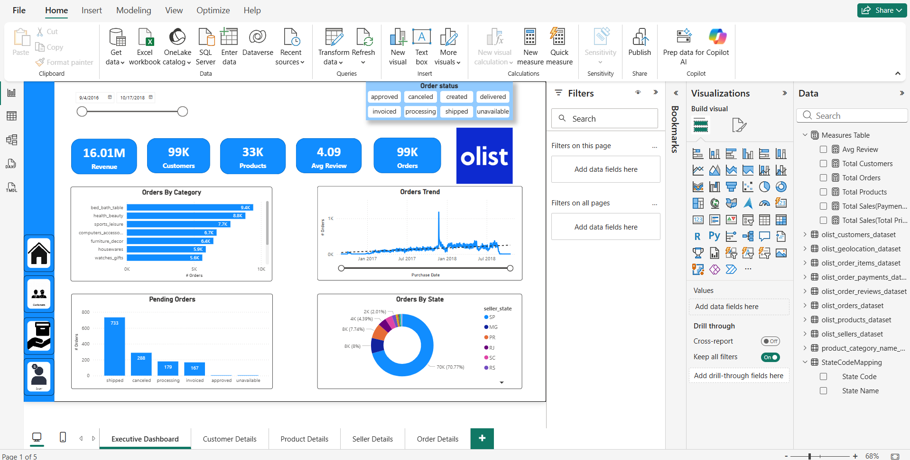
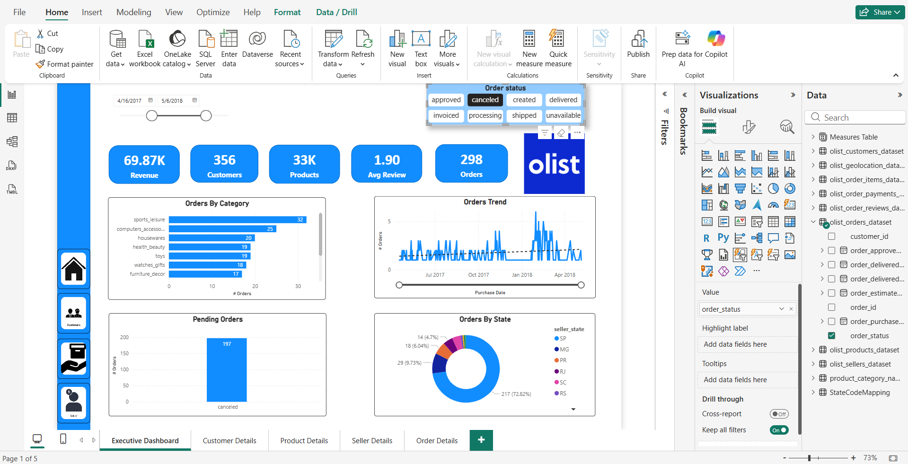
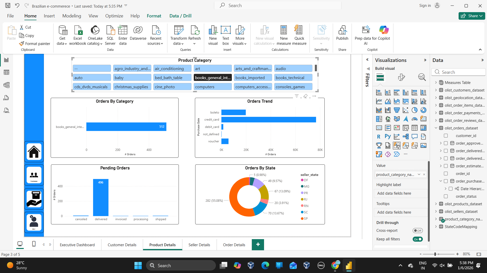
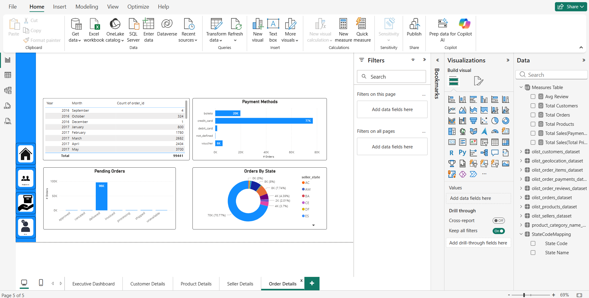

# 📊 Brazilian E-Commerce Power BI Dashboard
## 🔍 Project Overview

This project presents a multi-page interactive Power BI dashboard built using the Brazilian Olist e-commerce dataset.
The dashboard analyzes sales performance, product categories, geography, delivery delays, and customer reviews.

## 📌 Key Features

Multi-page dashboard with intuitive navigation

Top 10 product categories by revenue (Top-N filter)

Interactive slicers for date, category, and geography

Bookmarks and page navigation for better UX

## 🖼️ Dashboard Preview

### 1️⃣ Overall Business Overview

---

### 2️⃣ Filtered Business View

---

### 3️⃣ Top Revenue-Generating Categories

---

### 4️⃣ Geographic Performance Analysis

---

### 5️⃣ Project Details Page With Category-based Analysis

---

### 6️⃣ Order Details Page

## 📂 Dataset

Source: Kaggle

Link:
https://www.kaggle.com/datasets/olistbr/brazilian-ecommerce

## 📥 Power BI File (.pbix)

The Power BI report file is hosted externally due to GitHub file size limits:

Download link:
https://drive.google.com/file/d/19tRSmhu8CfSlnw_60Topth5dATZWu6qi/view?usp=sharing

## 🛠️ Tools & Technologies

Power BI Desktop

Power Query

DAX

Kaggle Dataset

GitHub

## 📈 Business Insights

A small number of product categories contribute to the majority of revenue

Certain states experience higher delivery delays

Higher customer review scores correlate with better sales performance

## 📌 Author

Divya Vaddam
